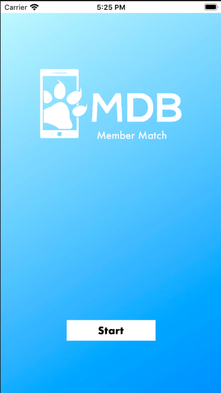
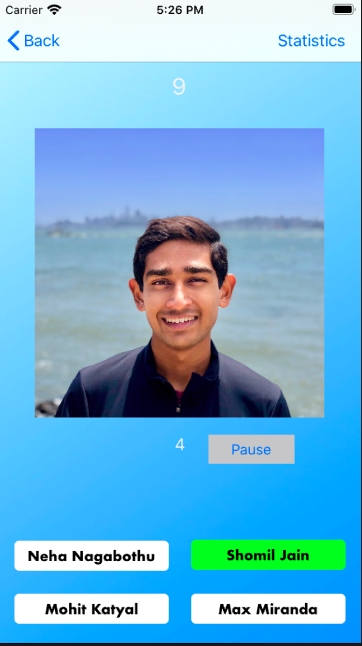
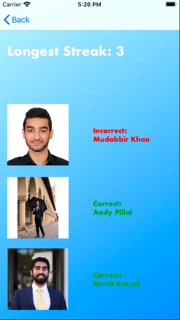

# MDB-Member-Match
This is MDB Mini-Project 1. This project is designed to teach the basics of Swift and mobile development. It is a game where you can increase your score by matching name to member. There includes several features such as a timer, a pause button, and even a statistics page.

Screenshots:

A simple starting screen to introduce the user to the app. You can also reset your statistics by visiting this page after you've played

Where the main game takes place. Match the name to the face to increase your score in 5 seconds or less. The color the button changes will tell you if you got it right or wrong. Feel free to take a break using the pause button but do know, it will reset your score so no cheating.

Track your progress at the statistics page. See your longest streak as well as the resuts to your last three questions. And don't worry, the game won't be running while your here.
